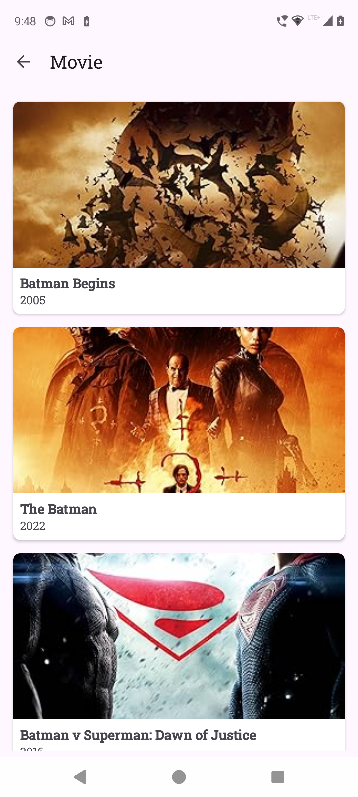
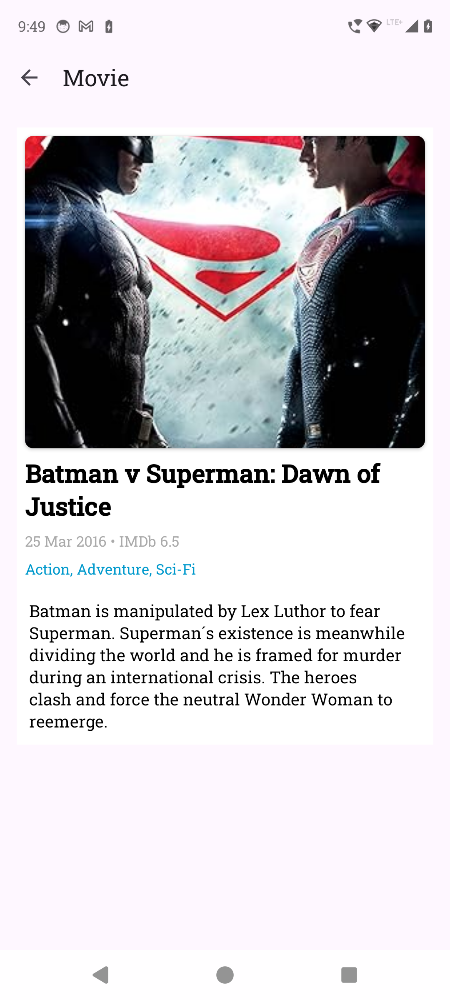

# Android Movie App

  

An Android application built using Kotlin that displays trending and searchable movies using the TMDB and OMDb APIs. The app showcases clean architecture and modern Android development practices.

# Tech Stack

Language: Kotlin

Architecture: MVVM

Dependency Injection: Hilt

Networking: Retrofit + OkHttp

Database: Room

Image Loading: Glide

Pagination: Paging 3

Background Tasks: WorkManager

# API Keys
OMDb API Key
REQRES API

(Place your keys in local.properties )
